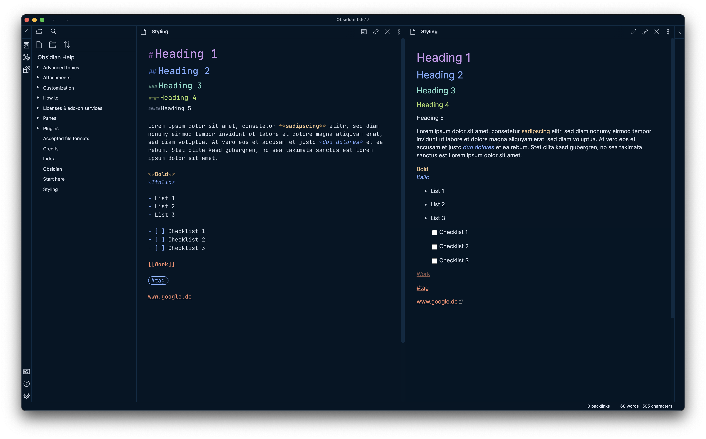

# Night Owl Theme for Obsidian
Based on the popular [Night Owl theme by Sarah Drasner](https://github.com/sdras/night-owl-vscode-theme)
for [Obsidian](https://obsidian.md)

## Install
1. Go to Settings -> Appearance
2. Activate "Custom CSS"
3. Copy "build/obsidian.css" file to your vault directory

## ToDo:
- [ ] Light Theme
- [ ] Style Graph View
- [ ] Options
- [ ] Improve Structure
